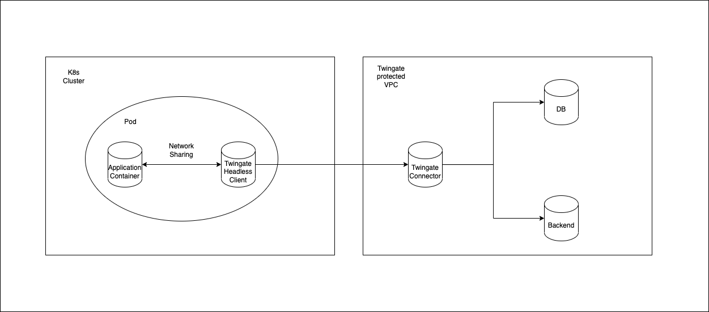

# tg-client-k8s-sidecar
This repository contains an example on how the Twingate headless client can be used to provide Kubernetes pods access to Twingate resources. The example follows a sidecar approach.

**Key use cases**

Zero Trust access to protected Twingate resources from K8s services including databases, web services and monitoring systems

**How to Use** 
1. Create Twingate service account and key in the Twingate admin UI, see [instruction](https://www.twingate.com/docs/services)
2. Add desired resources to the service account in the Twingate admin UI
3. Download the Twingate service key and base64 encode with commands such as `openssl base64 -in key.json -out key.base64`
4. Add the content of your base64 encoded service key to [secret.yaml](./secret.yaml)
5. Add the section `spec.template.spec.containers.sidecar-container` and `spec.template.spec.volume` sections from [deployment.yaml](./deployment.yaml) to your deployment
6. Deploy the secret.yaml and the updated deployment, i.e `kubectl create -f secret.yaml `, make sure the secret is deployed in the same namespace as the deployment

